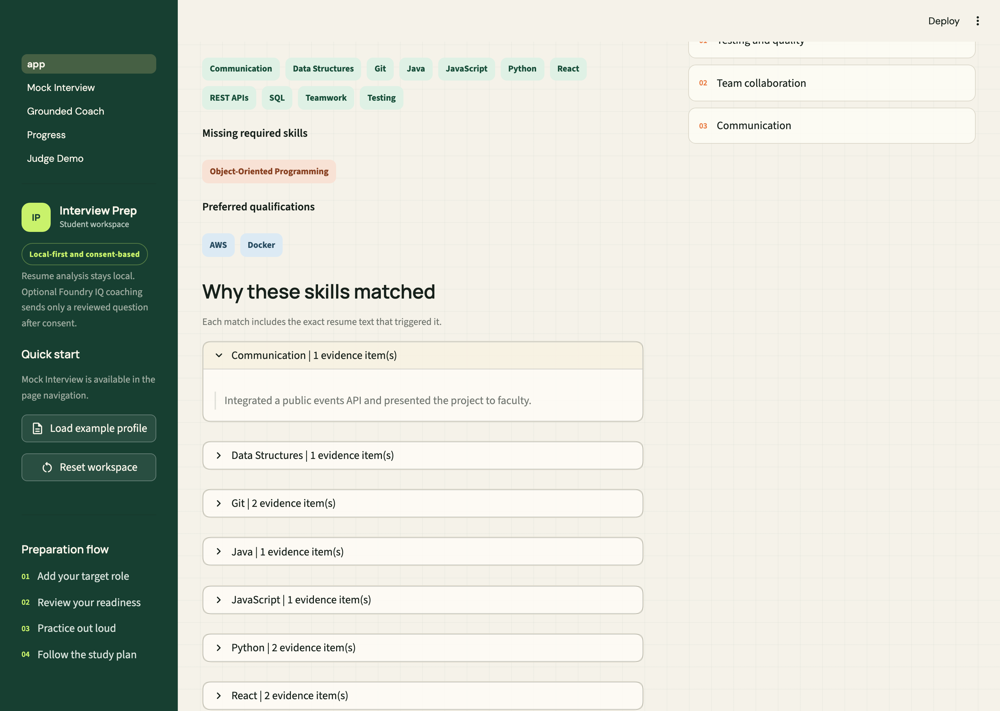
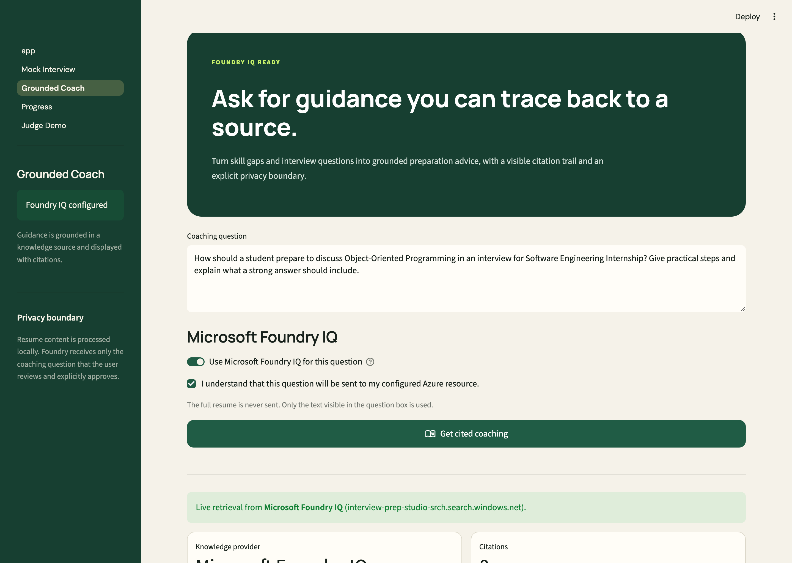
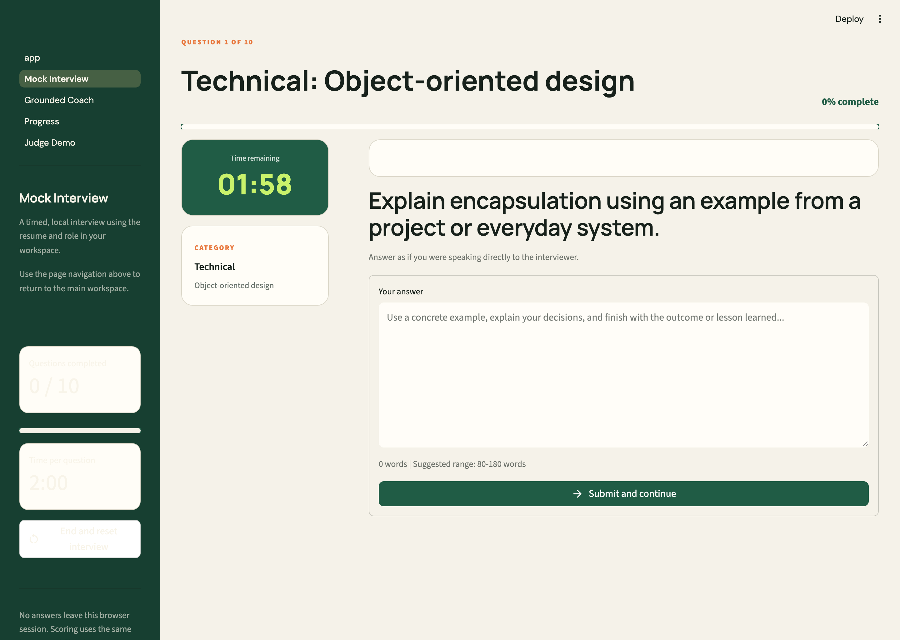
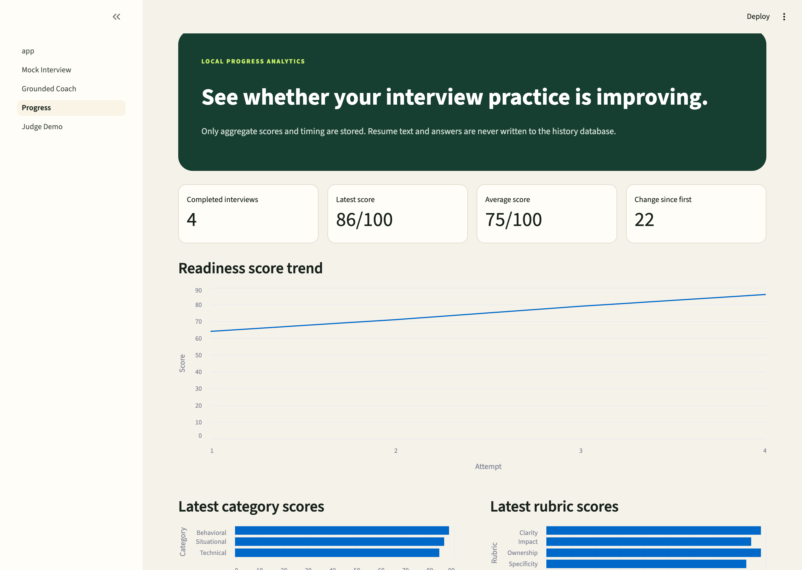

# Interview Prep Studio

Interview Prep Studio is a local-first Streamlit application for students
and early-career job seekers preparing for software engineering interviews.
It turns a PDF, DOCX, or pasted resume and job description into a practical preparation
workspace with explainable local analysis and optional Microsoft Foundry IQ
guidance backed by citations.

> Built for the Microsoft Agents League Hackathon 2026 (Creative Apps track).
> Integrates **Microsoft Foundry IQ** for cited, grounded coaching. See
> [`docs/FOUNDRY_IQ_SETUP.md`](docs/FOUNDRY_IQ_SETUP.md) and the
> [GitHub Copilot development journal](docs/COPILOT_DEVELOPMENT.md).

## Screenshots

| Evidence-backed role fit | Foundry IQ grounded coaching |
| --- | --- |
|  |  |

| Timed mock interview | Progress analytics |
| --- | --- |
|  |  |

> Images live in [`docs/screenshots/`](docs/screenshots/). Add the PNGs named
> there and these links resolve automatically.

## What It Does

### Role-fit dashboard

- Detects the job's role family and seniority
- Finds technical and professional skills in the job post
- Separates required skills from preferred qualifications
- Compares job requirements with skills shown on the resume
- Shows the exact resume excerpt supporting every matched skill
- Highlights strengths to discuss and gaps to prepare
- Identifies themes such as testing, teamwork, ownership, and communication

### Resume Lab

- Checks for Education, Skills, Projects, and Experience sections
- Counts resume bullets, action-led bullets, and quantified bullets
- Calculates a transparent readiness score
- Recommends the highest-impact resume edits
- Shows the extracted resume text for verification

### Practice Room

- Builds 6 or 9 questions from a curated question bank
- Includes technical, behavioral, and situational questions
- Prioritizes questions related to detected skill gaps
- Filters questions by category
- Scores answers using an explainable rubric
- Shows strengths, weaknesses, and an ordered revision checklist

### Mock Interview Mode

- Opens as a dedicated Streamlit page
- Builds exactly 10 questions from the analyzed resume and job description
- Uses a 4 technical, 3 behavioral, and 3 situational question balance
- Shows one question at a time to simulate a real interview
- Includes a live countdown with 1, 1.5, 2, or 3-minute timing options
- Records response time and whether an answer exceeded the timer
- Hides coaching until the complete interview is finished
- Calculates an overall interview readiness score
- Identifies repeated strengths and weaknesses across all answers
- Displays category and rubric performance charts
- Keeps every answer and score inside the active local session

### Seven-Day Plan

- Creates a role-specific preparation schedule
- Prioritizes the first missing technical skill
- Includes project stories, behavioral practice, and a mock interview
- Tracks completed tasks in the browser session
- Exports the complete preparation report as Markdown

### Grounded Coach

- Connects to a Microsoft Foundry IQ knowledge base through Azure AI Search
- Returns cited interview preparation guidance
- Shows citation metadata and retrieval activity
- Requires explicit consent before each cloud request
- Sends only the reviewed coaching question, not the full resume or answers
- Falls back to a bundled cited knowledge pack for offline demonstrations

### Progress Analytics

- Saves completed mock-interview summaries in local SQLite
- Displays readiness trends and latest category/rubric scores
- Stores aggregate metrics only
- Provides a delete-all-history privacy control

### Judge Demo Mode

- Prepares fictional sample data with one click
- Provides a three-minute walkthrough
- Explains the architecture and challenge requirement mapping
- Keeps the demonstration usable without personal data

## Privacy Model

Core resume and interview analysis is deterministic and local:

- No external request for resume parsing, matching, or answer scoring
- No resume or answer text stored in SQLite
- No hidden model deciding the score
- Exact resume evidence is shown for every skill match

Foundry IQ is optional and isolated:

- It is configured through gitignored Streamlit secrets
- It requires explicit user consent for each request
- It receives only the visible coaching question
- It returns grounded guidance with citations

Scores are preparation signals, not hiring predictions.

## Answer Scoring

Practice answers are scored from visible writing signals:

| Area | Weight | What the coach checks |
| --- | ---: | --- |
| Structure | 25% | Context, responsibility, action, and result |
| Specificity | 25% | Concrete examples, useful details, and numbers |
| Ownership | 20% | Clear individual actions and decisions |
| Impact | 20% | Outcomes, measurements, feedback, or lessons |
| Clarity | 10% | Useful length and readable sentence structure |

This rubric works best for improving answer structure. It does not verify
whether every technical statement is correct.

## Project Structure

```text
ai-interview-coach/
├── app.py
├── .streamlit/
│   └── config.toml              # Theme and upload settings
├── pages/
│   ├── 1_Mock_Interview.py      # Dedicated mock interview page
│   ├── 2_Grounded_Coach.py      # Foundry IQ and local cited guidance
│   ├── 3_Progress.py            # SQLite aggregate analytics
│   └── 4_Judge_Demo.py          # Guided hackathon demonstration
├── knowledge/                   # Curated attributed Markdown guidance
├── docs/                        # Architecture, setup, demo, Copilot journal
├── scripts/
│   └── check_public_repo.py     # Basic tracked-file credential scan
├── sample_data/
│   ├── sample_job_description.txt
│   └── sample_resume.txt
├── src/
│   ├── answer_evaluator.py      # Transparent answer rubric
│   ├── job_analysis.py          # Role and job-post analysis
│   ├── foundry_iq.py            # Azure AI Search knowledge retrieval
│   ├── grounded_coach_ui.py     # Consent and citation experience
│   ├── history_store.py         # Aggregate SQLite persistence
│   ├── judge_demo_ui.py         # Fictional judge walkthrough
│   ├── local_knowledge.py       # Offline cited knowledge retrieval
│   ├── models.py                # Shared data classes
│   ├── mock_interview.py        # Session analytics and question balance
│   ├── mock_interview_ui.py     # Timed mock interview interface
│   ├── preparation_plan.py      # Seven-day plan builder
│   ├── progress_ui.py           # Score trends and privacy controls
│   ├── question_generator.py    # Curated question selection
│   ├── resume_analysis.py       # Resume readiness checks
│   ├── resume_parser.py         # PDF, DOCX, and pasted-text validation
│   ├── session_report.py        # Markdown export
│   ├── skill_analysis.py        # Skill extraction and comparison
│   └── ui.py                    # Streamlit interface and styling
├── tests/
├── requirements.txt
└── requirements-dev.txt
└── requirements-dev.txt
```

## Setup

### 1. Clone and enter the project

```bash
git clone https://github.com/alstondsouza1/ai-interview-coach.git
cd ai-interview-coach
```

### 2. Create a virtual environment

macOS or Linux:

```bash
python3 -m venv .venv
source .venv/bin/activate
```

Windows PowerShell:

```powershell
py -m venv .venv
.venv\Scripts\Activate.ps1
```

### 3. Install dependencies

```bash
pip install -r requirements.txt
```

### 4. Start the application

```bash
streamlit run app.py
```

Open `http://localhost:8501` if the browser does not open automatically.

## Quick Demo

1. Select **Load example profile** in the sidebar.
2. Select **Build my preparation workspace**.
3. Review the **Overview** and **Resume Lab** tabs.
4. Write an answer in the **Practice Room** and score it.
5. Open **Mock Interview** from Streamlit's page navigation.
6. Complete the timed 10-question interview.
7. Review category charts and the overall readiness score.
8. Open **Grounded Coach** and show a cited answer.
9. Open **Progress** to review aggregate trends.
10. Check tasks in the **7-Day Plan**.
11. Download the preparation report.

The included resume and job description are fictional sample data.

## Using Your Own Resume

1. Upload a PDF or DOCX resume under 5 MB, or paste the resume text.
2. Paste the complete job description, including preferred qualifications.
3. Choose two or three questions per category.
4. Build the workspace.

PDF files are limited to 10 pages. DOCX paragraphs and tables are supported.
Scanned image-only PDFs are not supported because the project does not include
OCR. Export the resume from a document editor as a text-based PDF, use DOCX, or
paste the text directly.

## Evidence-Backed Matching

The project does not claim that a keyword proves proficiency. Instead, every
matched skill links back to one or two resume excerpts that caused the match.
This gives users and judges a clear audit trail:

```text
Python
└── "Built a Flask API with Python and PostgreSQL for 40 students."
```

Job skills are also separated into:

- **Required:** skills listed in requirements or minimum qualifications
- **Preferred:** skills listed as preferred, optional, a bonus, or a plus

The main role-match metric uses required qualifications so optional skills do
not unfairly reduce the candidate's score.

## Running a Mock Interview

The mock interview uses the resume and job analysis already created in the
main workspace:

1. Build the preparation workspace first.
2. Open **Mock Interview** from Streamlit's page navigation.
3. Select a time limit for each question.
4. Start the interview and answer each question in order.
5. Submit an answer to move to the next question.
6. Review results after all 10 answers are complete.

The timer does not delete an answer when time expires. It records the timeout
and allows the user to finish typing, which keeps the practice session usable
while still providing pacing feedback.

Readiness labels are intentionally conservative:

| Completed score | Readiness label |
| ---: | --- |
| 82-100 | Interview ready |
| 68-81 | Nearly ready |
| 52-67 | Developing |
| 0-51 | Needs focused practice |

An incomplete interview is always labeled **In progress**.

## Microsoft Foundry IQ

The Creative Apps challenge requires a Microsoft IQ intelligence layer.
Interview Prep Studio integrates the Foundry IQ knowledge-base retrieve API:

```text
POST /knowledgebases/{knowledge-base}/retrieve
     ?api-version=2026-05-01-preview
```

Follow [`docs/FOUNDRY_IQ_SETUP.md`](docs/FOUNDRY_IQ_SETUP.md) to:

1. Create or connect Azure AI Search.
2. Create `interview-coaching-kb`.
3. Add the documents in `knowledge/`.
4. Configure `.streamlit/secrets.toml`.
5. Verify a response with citations.

The app works in local cited-knowledge mode until Foundry IQ is configured.
For hackathon eligibility, configure the real resource and capture screenshots
of the knowledge base, source connection, and cited retrieval result.

## GitHub Copilot Requirement

The challenge also requires meaningful GitHub Copilot use. The repository
includes:

- [Copilot repository instructions](.github/copilot-instructions.md)
- [Development journal template](docs/COPILOT_DEVELOPMENT.md)

You must personally use GitHub Copilot and add truthful prompts, screenshots,
accepted or modified suggestions, and related commit hashes. Do not represent
Codex-assisted work as GitHub Copilot usage.

## Local Progress Database

After a complete mock interview, the app writes aggregate data to:

```text
data/interview_history.db
```

The `data/` directory is gitignored. Stored fields include role title, score,
category averages, rubric averages, timing, and readiness. Resume text, job
description text, and answer text are never stored.

## Development

Install development dependencies:

```bash
pip install -r requirements-dev.txt
```

Run the tests:

```bash
pytest -q
```

Scan tracked files for common credential patterns:

```bash
python3 scripts/check_public_repo.py
```

The suite covers:

- Empty and invalid PDF uploads
- DOCX paragraph and table extraction
- Pasted-resume validation
- Skill aliases and skill-gap calculations
- Required and preferred qualification classification
- Evidence excerpts for matched skills
- Balanced question selection
- Transparent answer scoring
- Ten-question mock interview balance
- Countdown timer boundaries
- Category and rubric score aggregation
- Interview readiness thresholds
- Foundry IQ response and citation parsing
- Local cited knowledge fallback
- SQLite history save, replacement, retrieval, and deletion
- Resume structure and quantified bullet checks
- Job-family and internship detection
- Seven-day plan generation
- Markdown report export

## Commit History

The redesign was completed in focused, student-readable commits:

```text
refactor: replace AI services with local coaching
feat: add resume insights and preparation plans
feat: redesign the preparation workspace
test: cover exports and add app defaults
docs: document the private interview prep studio
```

Each commit represents one clear part of the application and can be explained
independently during a project review.

## Limitations

- Skill matching uses a curated software-role catalog.
- Keyword presence does not prove experience or proficiency.
- Answer scoring evaluates structure, not technical truth.
- Session progress is not saved after the Streamlit session ends.
- In-progress mock answers are cleared when the Streamlit session resets.
- Completed aggregate mock results remain local until deleted.
- PDFs must contain extractable text.
- Required/preferred classification depends on clear job-post section labels.
- Foundry IQ cloud guidance requires a configured Azure resource.

## Hackathon Documentation

- [Architecture](docs/ARCHITECTURE.md)
- [Foundry IQ setup](docs/FOUNDRY_IQ_SETUP.md)
- [GitHub Copilot journal](docs/COPILOT_DEVELOPMENT.md)
- [Three-minute demo](docs/DEMO_SCRIPT.md)
- [Deployment](docs/DEPLOYMENT.md)
- [Privacy notice](docs/PRIVACY.md)
- [Submission checklist](docs/SUBMISSION_CHECKLIST.md)

## Possible Next Features

- Add more role families such as cybersecurity and product management
- Add optional speech recording without cloud processing
- Replace API-key Foundry authentication with Microsoft Entra identity

## License

This project is available under the [MIT License](LICENSE).
